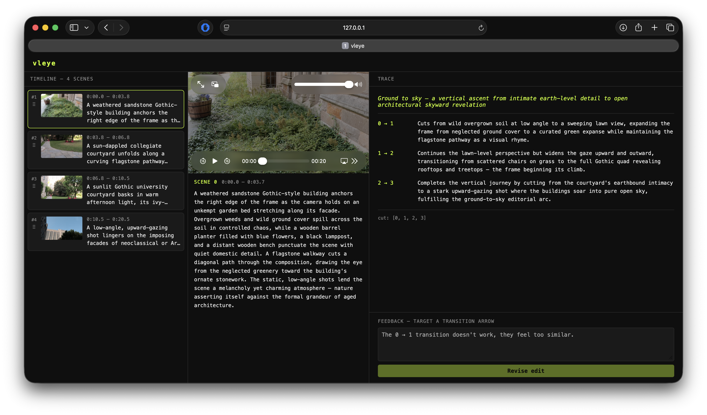

# VLeye

A vision-language library for understanding and editing video. Open source, runs locally, takes minutes, costs cents.

Proof of concept. The interesting parts are the architecture, not the feature set, which is easily extendable.



> **Three panels.** Left: draggable scene cards in edit order. Center: click any card to preview that clip. Right: the structured reasoning trace; thesis, one argument per cut arrow, feedback input that targets individual transitions.

---

## What it costs

Editing 3 minutes of footage into a 90-second clip with ~10 scene cuts:

| Stage | Method | LLM calls | Cost (Sonnet) | Cost (Gemini Flash) |
|---|---|---|---|---|
| Frame diff | Histogram/perceptual hash | 0 | $0.00 | $0.00 |
| Transcription | Whisper | 0 | ~$0.02 | ~$0.02 |
| Boundary refinement | Binary search with VLM | ~50 | ~$0.25 | ~$0.01 |
| Scene description | 1 interior frame per scene | ~11 | ~$0.06 | ~$0.005 |
| Reorder + trace | Text-only reasoning | 1 | ~$0.05 | ~$0.01 |
| **Total** | | **~62** | **~$0.38** | **~$0.05** |

Comparable SaaS products charge $1-2 per video and require uploading your footage to their servers. 

## What it does

1. **Segment**: finds scene boundaries using frame differencing to identify candidate regions, then binary-searches each region with a VLM to find exact cut points.
2. **Describe**: every frame the VLM sees produces a structured observation (setting, subjects, action, composition, mood). Scenes are a computed view over these observations.
3. **Transcribe**: runs Whisper once upfront, aligns timestamped words to scenes.
4. **Reason**: the LLM produces an editorial reasoning trace, not just a scene order. The trace is the edit. The scene order is derived from it.
5. **Iterate**: user feedback targets specific reasoning ("the transition at 0:45 feels abrupt"), the LLM re-evaluates its own argument and revises the trace. The edit stays internally coherent across iterations.
6. **Render**: shells out to FFmpeg.

Optional: beat-aligned cutting via onset detection (librosa) to snap cuts to a music track.

## The trace

Most AI editing tools output a scene order. vleye outputs a reasoning document. 

The LLM interprets your footage, proposes a structure, and defends its choices: "I placed the wide landscape after the direct address because the speaker needs room to land." When you push back, it doesn't just swap clips. It revisits the specific argument that produced that choice and either revises or holds.

The trace accumulates your taste over iterations. It's the artifact with authorship. The order is just the render instruction.

You can prompt with different editorial philosophies ("edit like an essay film", "edit like Chris Marker would") and compare the reasoning traces side by side. Same footage, different arguments.

## Architecture

```
lib/
  driver.py        # VLM interface: analyze_frame, summarize, reorder
  stt.py           # Whisper transcription
  segmenter.py     # frame diff + binary search boundary refinement
  scene.py         # scene data model, folder I/O
  orchestrator.py  # project state, trace, ordering, feedback loop
  renderer.py      # FFmpeg assembly

cli.py             # thin CLI wrapper
gui/               # scene card viewer, drag-to-reorder
```

### Data model

Every frame observation is stored as `(frame_index, timestamp, visual_analysis)`. This is the only raw data. Boundary detection and scene description are both derived from the same observation pool. Re-segmenting never recomputes a frame already seen.

Project structure on disk:

```
project/
  orchestrator.json   # scene order, reasoning trace, feedback history, config
  scene_001/
    meta.json          # start_frame, end_frame, timestamps, source_video
    description.txt    # synthesized scene description
    thumbnail.jpg      # representative frame
    observations.jsonl # raw (frame_index, timestamp, visual_analysis) entries
  scene_002/
    ...
```

### Frame analysis schema

```json
{
  "frame_index": 1420,
  "timestamp": 47.33,
  "setting": "outdoor pier, overcast",
  "subjects": ["woman in red coat", "dog"],
  "action": "walking away from camera",
  "composition": "wide shot, subject at left third",
  "mood": "muted, cool light, contemplative"
}
```

### Driver interface

```python
analyze_frame(image) -> dict        # structured visual analysis
summarize_descriptions(list[dict]) -> str  # scene-level summary
reorder(scenes, prompt) -> (list[int], str)  # order + reasoning trace
revise(trace, feedback) -> (list[int], str)  # revised order + updated trace
transcribe(audio_path) -> list[dict]         # Whisper, no LLM
```

Model is configured once in the driver. Swapping models is changing one string. The rest of the codebase never touches the API directly.

### Segmentation pipeline

1. **Frame diff**: histogram or perceptual hash across all frames. Identifies candidate change regions. Pure compute, no LLM.
2. **Binary search**: for each candidate region, the VLM inspects endpoints and midpoints to narrow the exact cut frame. Each inspection adds to the observation pool.
3. **Scene construction**: group contiguous observations with consistent descriptions. Boundaries stabilize when adjacent observations agree.

Short clips sample more densely, long videos more sparsely: `interval = clamp(log(duration) * k, 1, 3)` seconds. Total LLM cost scales with scene count, not video length.

## Dependencies

- ffmpeg (system)
- whisper (transcription)
- Pillow (frame extraction, title cards)
- librosa (optional, beat detection)
- An API key for any VLM provider (Anthropic, OpenAI, Google)

## License

MIT.

```
Built entirely on public algorithms and open models. No proprietary methods. We ❤️ open source.
```
